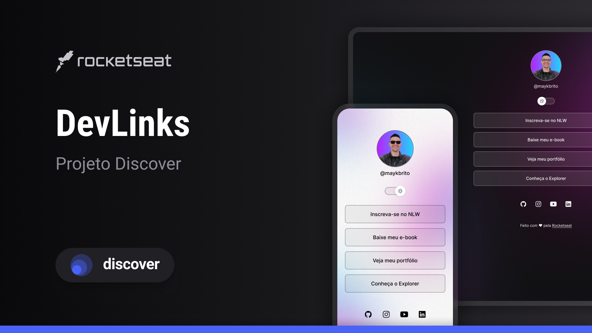

<h1 align="center"> Devlinks </h1>

Course promoted by Rocketseat for teaching WEB technologies.

  <a href="#-technologies">Tecnologias</a>&nbsp;&nbsp;&nbsp;|&nbsp;&nbsp;&nbsp;
  <a href="#-project">Projeto</a>&nbsp;&nbsp;&nbsp;|&nbsp;&nbsp;&nbsp;
  <a href="#-layout">Layout</a>&nbsp;&nbsp;&nbsp;|&nbsp;&nbsp;&nbsp;
  <a href="#memo-license">Licença</a>

  

 

## 🚀 Technologies

This project was developed with the following technologies:

- HTML e CSS
- JavaScript
- Git e Github
- Figma

## 💻 Projet

Devlinks is a link aggregator to use as an online business card

## 🔖 Layout

You can view the project layout through [THIS LINK](https://www.figma.com/file/J1Z33MISC22YZB8wfxiIns/NLW-Copa-Explorer/duplicate). É necessário ter conta no [Figma](https://figma.com) para acessá-lo.

## :memo: Licença

This project is under the MIT license.

---

Made with ♥ by Paulodesbravador :wave: [My Github!](https://github.com/PaulodesbravadorBR)
